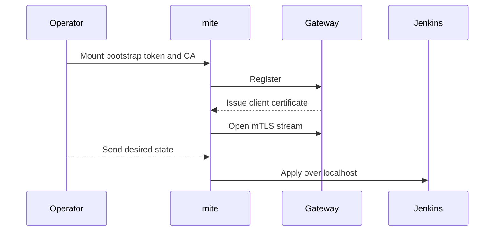

# The mite

The mite is a sidecar in every managed Jenkins pod. It is the authenticated control channel between Varroa and that Jenkins controller.

## What It Does

The mite opens an outbound gRPC stream to the gateway, reports Jenkins health and observed state, applies desired configuration through Jenkins localhost endpoints, and returns command results. It also drains builds during a planned pod termination when a drain timeout is configured.

A healthy Jenkins web interface does not imply a healthy control channel. Varroa cannot converge configuration while the mite is disconnected.

## Registration and Authentication



The bootstrap token is bound to one controller, expires after 15 minutes, and can be consumed once. The gateway then issues a 72-hour client certificate for that controller identity. The mite renews the certificate before expiry.

The mite does not store a Jenkins password or API token. The operator sends a short-lived, controller-specific JWT over the mTLS stream. The mite keeps it in memory and presents it to Jenkins as a bearer token. The Varroa security realm plugin verifies the JWT locally.

Registration fails closed if the bootstrap token, certificate authority, or controller identity is invalid.

## Connection Behavior

The mite sends a heartbeat every 15 seconds. A broken stream reconnects with exponential backoff capped at two minutes. Gateway replicas do not require sticky routing.

Each desired-state command has a deadline. The default is 20 minutes. Set `ProvisioningDefaults.spec.commandDeadlineSec` to change it for the installation.

The effective reconciliation policy controls termination draining. The default drain timeout is 900 seconds. During termination the mite places Jenkins in quiet-down mode, waits for running builds, then exits when builds finish or the timeout expires.

## Diagnose a Mite

Controller resources carry a short unique suffix derived from the controller UID. The StatefulSet is usually named `<name>-<uid8>`, but the name is adjusted to stay a valid Kubernetes object name. A controller whose name does not begin with a lowercase letter gains a `c-` prefix, so `1demo` becomes `c-1demo-<uid8>`, and a long name is truncated to fit. When either applies, list the StatefulSets in the namespace and use the name you find:

```bash
kubectl get statefulset -n <namespace>
```

Inspect the controller first:

```bash
kubectl get controller <name> -n <namespace> \
  -o jsonpath='{.status.phase}{"\n"}{.status.miteStatus}{"\n"}'
kubectl logs -n <namespace> statefulset/<name>-<uid8> -c mite --tail=100
```

| Symptom | Check |
|---|---|
| Phase remains `Running` | Gateway reachability on TCP 9090, bootstrap token errors, and mite logs. |
| Frequent reconnects | Gateway availability, NetworkPolicy, DNS, and certificate errors. |
| `MiteStreamDegraded=True` | NATS availability between the gateway and operator. The stream may be connected while commands are delayed. |
| Commands time out | Jenkins readiness, command deadline, and long-running configuration work. |
| Planned restart interrupts builds | Effective `drainTimeoutSeconds` and termination grace period. |

Changing `spec.miteSpec.image`, pull policy, or resources requires a pod roll. See [Pod customization](../config/pod-customization.md) and [Reconciliation](../operations/reconciliation.md).
