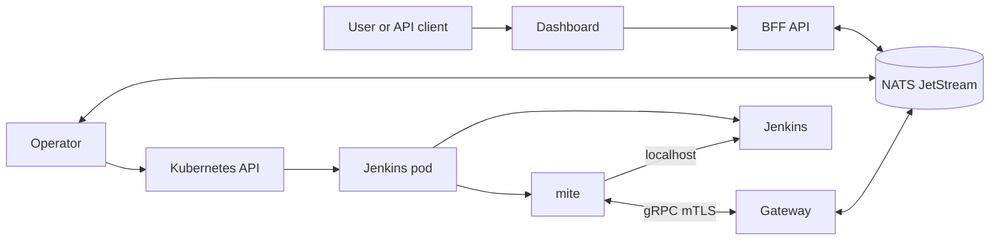

# Architecture Overview

Varroa manages Jenkins controllers as Kubernetes resources. One namespaced `Controller` creates one Jenkins StatefulSet, Service, persistent volume, mite sidecar, and optional Ingress.

## Control Plane



| Component | Function |
|---|---|
| Operator | Provisions Jenkins resources. |
| Gateway | Terminates mite mTLS. |
| BFF | Serves APIs and activity. |
| Dashboard | Provides the browser client. |
| NATS JetStream | Carries messages and shared state. |
| mite | Observes and configures Jenkins. |
| Dex | Brokers identity into OIDC. |
| Update center | Serves pinned plugins. |

Only the dashboard, BFF, and Jenkins routes need external HTTP access. The gateway remains a cluster-internal Service. The mite initiates its connection, so the control plane does not require inbound access to Jenkins.

## Controller Configuration

Varroa resolves a controller from installation defaults, an optional `ControllerClass`, and the `Controller` spec. The controller spec has the highest precedence.

Jenkins configuration comes from a `ComposedBundle`. Its ordered inputs can reference catalog items, Git repositories, or OCI artifacts. An omitted `spec.composedBundleRef` selects the built-in `varroa-starter` bundle. A `JenkinsVersionProfile` supplies the compatible plugin set and any version-specific JCasC overlay. `JenkinsRole` and `JenkinsRoleBinding` resources define Jenkins authorization.

See [Composed bundles](../config/composed-bundles.md), [Jenkins versions](../config/jenkins-versions.md), and [Jenkins RBAC](../security/jenkins-rbac.md).

## Lifecycle

Read `status.phase` and `status.conditions` when operating a controller.

| Phase | Meaning |
|---|---|
| `Pending` | Waiting for reconciliation. |
| `Provisioning` | Resolving configuration or creating Kubernetes resources. |
| `Running` | Jenkins is running, but the mite stream is not ready. |
| `Connected` | The mite stream is active. This is the normal steady state. |
| `Stopped` | `spec.powerState: Stopped` scaled the StatefulSet to zero. |
| `Hibernated` | Inactivity policy parked the controller. |
| `Failed` | A blocking provisioning or operation error occurred. |

Reloadable configuration can apply without replacing the pod. Changes to plugins, images, or other restart-class settings can return the controller to `Provisioning` while Varroa rolls it.

```bash
kubectl get controller <name> -n <namespace>
kubectl describe controller <name> -n <namespace>
```

Use [Troubleshooting](../operations/troubleshooting.md) when a controller does not reach `Connected`.

## Core Resources

All resources use `varroa.dev/v1alpha1`.

| Resource | Scope | Purpose |
|---|---|---|
| `Controller` | Namespaced | Declares one Jenkins controller. |
| `ComposedBundle`, `CatalogSource`, `CatalogItem` | Namespaced | Supply Jenkins configuration. |
| `PodTemplate` | Namespaced | Defines reusable Kubernetes agents. |
| `ProvisioningDefaults`, `ControllerClass` | Cluster | Supply reusable controller defaults. |
| `JenkinsVersionProfile` | Cluster | Pins Jenkins and plugin compatibility. |
| `VarroaRole`, `VarroaRoleBinding` | Cluster | Authorize dashboard and API actions. |
| `JenkinsRole`, `JenkinsRoleBinding` | Cluster | Authorize actions inside Jenkins. |
| `UpdateCenter` | Cluster | Declares the optional plugin service. |

Continue with [The mite](mite.md), [Scaling](scaling.md), or [Your first controller](../tutorials/first-controller.md).
